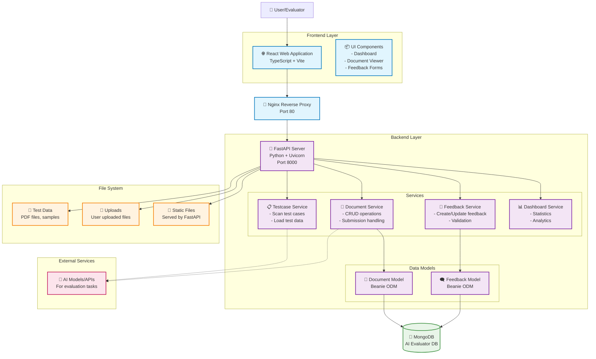

# AI Evaluator Architecture

This document provides an overview of the AI Evaluator system architecture.

## System Architecture Diagram

## Component Overview

### Frontend Layer
- **React Web Application**: Modern SPA built with TypeScript, Vite, and Tailwind CSS
- **UI Components**: Reusable components for dashboard, document viewing, and feedback collection
- **Routing**: Client-side routing with React Router for navigation

### Backend Layer
- **FastAPI Server**: High-performance Python API server with automatic OpenAPI documentation
- **Service Architecture**: Modular services handling different business domains:
  - **Testcase Service**: Manages test case scanning and loading
  - **Document Service**: Handles document CRUD operations and submissions
  - **Feedback Service**: Manages user feedback collection and validation
  - **Dashboard Service**: Provides statistics and analytics data

### Database Layer
- **MongoDB**: Document database for storing evaluation data
- **Beanie ODM**: Async Object Document Mapper for Python/MongoDB integration
- **Data Models**: Structured schemas for Documents and Feedback

### File Storage
- **Test Data**: Static test files and sample documents
- **Uploads**: User-uploaded files for evaluation
- **Static File Serving**: Direct file access through FastAPI

### Infrastructure
- **Docker Containerization**: Both frontend and backend are containerized
- **Nginx Reverse Proxy**: Handles HTTP traffic routing and static file serving
- **CORS Support**: Configured for cross-origin requests between frontend and backend

## Data Flow

1. User interacts with the React frontend
2. Frontend makes HTTP requests to the FastAPI backend
3. Backend services process requests and interact with MongoDB
4. File operations access local storage directories
5. Response data flows back through the service layer to the frontend
6. UI updates based on the received data

## Key Features

- **Document Evaluation**: Upload and evaluate AI-generated documents
- **Feedback System**: Collect and manage evaluation feedback
- **Dashboard Analytics**: View statistics and evaluation metrics
- **Test Case Management**: Load and manage test scenarios
- **Real-time Updates**: Async operations for smooth user experience